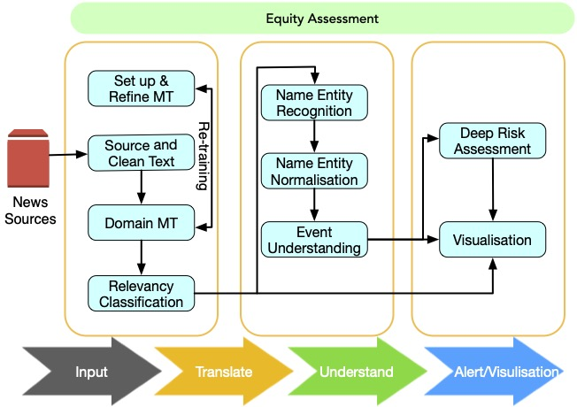

# BioCaster in 2021: Automatic Disease Outbreaks Detection from Global News Media

---

BioCaster was launched in 2008 to provide an ontology-based text mining system for early
disease detection from open news sources. Following a six-year break, we have re-launched the system
in 2021. Our goal is to systematically upgrade the methodology using state-of-the-art neural network
language models, whilst retaining the original benefits that the system provided in terms of logical
reasoning and automated early detection of infectious disease outbreaks. Here we present recent
extensions such as neural machine translation in 10 languages, neural classification of disease outbreak
reports, and a new cloud-based visualisation dashboard. Furthermore, we discuss our vision for further
improvements, including combining risk assessment with event semantics and assessing the risk of
outbreaks with multi-granularity. We hope that these efforts will benefit the global public health community.

 ## Repo Structure
- `med_doc_cls`: source codes of relevance classification task.

- `sapbert`: source codes of the SapBERT entity linking model.

- `biocaster-ontology`: the BioCaster ontology against which the patterns are created.

- `srl-editor`: the BioCaster rule engine.

  

## BioCaster Structure

## Huggingface Models

- Relevance Classification: The [[PubMedBERT]](https://huggingface.co/microsoft/BiomedNLP-PubMedBERT-base-uncased-abstract-fulltext) model is used for relevance classification.

- Entity Linking: The [\[SapBERT\]](https://huggingface.co/cambridgeltl/SapBERT-from-PubMedBERT-fulltext) model is used for entity linking. 

  >  Standard SapBERT as described in [\[Liu et al., NAACL 2021\]](https://www.aclweb.org/anthology/2021.naacl-main.334.pdf). Trained with UMLS 2020AA (English only), using `microsoft/BiomedNLP-PubMedBERT-base-uncased-abstract-fulltext` as the base model. For [\[SapBERT\]](https://huggingface.co/cambridgeltl/SapBERT-from-PubMedBERT-fulltext), use `[CLS]` (before pooler) as the representation of the input; for [\[SapBERT-mean-token\]](https://huggingface.co/cambridgeltl/SapBERT-from-PubMedBERT-fulltext-mean-token), use mean-pooling across all tokens.

## Acknowledgement

BioCaster is only possible thanks to freely available information sources on the Web. We are very grateful in particular to the following sources listed below. Whilst we acknowledge these organisations, mention here does not imply any endorsement or affiliation.

- [Google News](https://news.google.com/) – a commercial news aggregator service developed by Google.
- [ProMed Mail](https://promedmail.org/) – a program of the International Society for Infectious Diseases for identifying unusual health events.
- [Medisys](https://medisys.newsbrief.eu/) – a fully-automated event-based media monitoring system to rapidly identify potential public health threats from open source media.
- [World Health Organisation](https://www.who.int/) – a specialised agency of the United Nations responsible for international public health.
- [The United Nations](https://www.un.org/) – an intergovernmental organization aiming to maintain international peace and security.
- [The European Centre for Disease Prevention and Control](https://www.ecdc.europa.eu/en) – an agency of the European Union aimed at strengthening Europe’s defences against infectious diseases.
- [Center for Infectious Disease Research and Policy](https://www.cidrap.umn.edu/) – a center within the University of Minnesota focusing on public health preparedness.
- [EurekAlert!](https://www.eurekalert.org/) – a non-profit news-release distribution platform operated by the American Association for the Advancement of Science (AAAS).
- [China News Service](https://www.chinanews.com/) – a state-level news agency in China.
- [The Food and Agriculture Organization of the United Nations](http://www.fao.org/home/en/) – a specialised agency of the United Nations that leads international efforts to defeat hunger.

Please note that disease news data changes rapidly and differs by location and language so it may not reflect the pattern of disease outbreaks in some areas, for example some areas may be over-reported and some may be under-reported. The numbers of news reports on BioCaster may differ from aggregated data on other disease outbreak monitoring sites because the data is gathered and analysed in different ways. The relationship between news report counts and outbreak cases is a complex one that we are currently trying to understand in our research.

